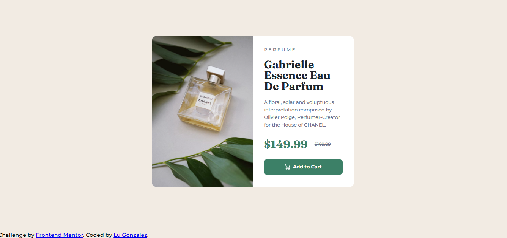

# Frontend Mentor - Product preview card component

A responsive product preview card built with HTML and CSS as part of a Frontend Mentor challenge.

## Table of contents

- [Overview](#overview)
  - [The challenge](#the-challenge)
  - [Screenshot](#screenshot)
  - [Links](#links)
- [My process](#my-process)
  - [Built with](#built-with)
  - [What I learned](#what-i-learned)
  - [Continued development](#continued-development)
  - [Useful resources](#useful-resources)
  - [AI Collaboration](#ai-collaboration)
- [Author](#author)
- [Acknowledgments](#acknowledgments)

## Overview

### The challenge

The challenge was to build a product preview card component and make it as close as possible to the provided design.

Users should be able to:

- View the optimal layout depending on their device's screen size.
- See hover and focus states for interactive elements.

### Screenshot

### Links

- Solution URL: [GitHub Repository](https://github.com/luuglz-ai/product-preview-card-component)
- Live Site URL: [View Live Site](https://luuglz-ai.github.io/product-preview-card-component/)

## My process

### Built with

- Semantic HTML5
- CSS
- Flexbox
- Responsive design
- Google Fonts

### What I learned

During this project, I learned how to:

- Make a responsive layout that adapts to different screen sizes.
- Use `:hover` and `:focus` states for interactive elements.
- Use Flexbox to organize and align elements on the page.
- Structure a page using semantic HTML elements.
- Use different fonts with Google Fonts and apply them with CSS.
- Use the `<picture>` element to display different images depending on the screen size.

### Continued development

I want to keep improving my CSS skills, especially responsive design and Flexbox. I also want to continue learning how to build more accessible and well-structured websites.

### Useful resources

- [Frontend Mentor](https://www.frontendmentor.io/) - I used this platform to complete the challenge and practice my HTML and CSS skills.
- [Google Fonts](https://fonts.google.com/) - I used it to add the Montserrat and Fraunces fonts to the project.

### AI Collaboration

I used ChatGPT occasionally to clarify some HTML and CSS concepts, understand certain errors, and get help when I had doubts during the project. The project was built by me, using AI only as a small support while learning.

## Author

- GitHub - [luuglz-ai](https://github.com/luuglz-ai)
- Twitter - [@luliiiglz](https://x.com/luliiiglz?s=11)
- Instagram - [@luli.glz](https://www.instagram.com/luli.glz?stkn=N2ppMHI4ZHB4eGZ2&utm_-source=qr) 

## Acknowledgments

Thanks to Frontend Mentor for providing this challenge and design.